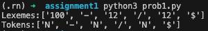
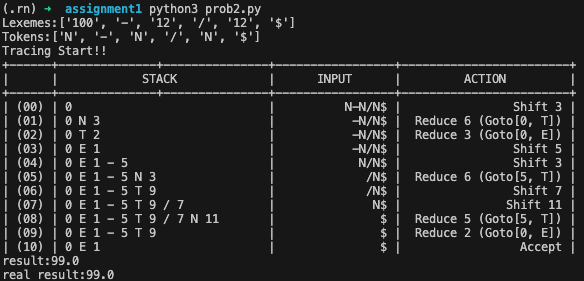
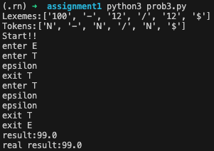
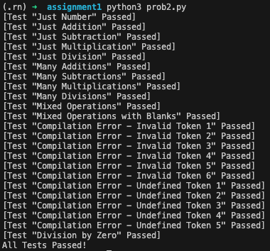
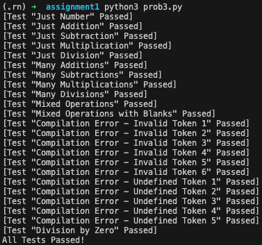

# HW #1 Implementation of Parsing Algorithms

Author: 2020021949 구건모

이 문서는 Parsing Algorithms를 구현한 과제에 대한 설명을 담고 있습니다.

## 0. Build Parsing table for given BNF

주어진 BNF는 다음과 같습니다.

0. E' -> E
1. E -> E + T
2. E -> E - T
3. E -> T
4. T -> T * N
5. T -> T / N
6. T -> N

위 BNF를 이용하여 Parsing Table을 구성하였습니다. Parsing Table은 다음과 같습니다.

|  #  |  +  |  -  |  *  |  N  |  /  |  $  |  \| |  E'  |  E  |  T  |
|-----|-----|-----|-----|-----|-----|-----|-----|------|-----|-----|
|  0  |     |     |     |  S3 |     |     |  \| |      |  1  |  2  |
|  1  |  S4 |  S5 |     |     |     | ACC |  \| |      |     |     |
|  2  |  R3 |  R3 |  S6 |     |  S7 |  R3 |  \| |      |     |     |
|  3  |  R6 |  R6 |  R6 |     |  R6 |  R6 |  \| |      |     |     |
|  4  |     |     |     |  S3 |     |     |  \| |      |     |  8  |
|  5  |     |     |     |  S3 |     |     |  \| |      |     |  9  |
|  6  |     |     |     | S10 |     |     |  \| |      |     |     |
|  7  |     |     |     | S11 |     |     |  \| |      |     |     |
|  8  |  R1 |  R1 |  S6 |     |  S7 |  R1 |  \| |      |     |     |
|  9  |  R2 |  R2 |  S6 |     |  S7 |  R2 |  \| |      |     |     |
|  10 |  R4 |  R4 |  R4 |     |  R4 |  R4 |  \| |      |     |     |
|  11 |  R5 |  R5 |  R5 |     |  R5 |  R5 |  \| |      |     |     |

## 1. Implement Lexical Analyzer

구현된 코드는 `prob1.py` 에서 확인할 수 있습니다.

다음 두 가지 class를 이용해서 Lexical Analyzer를 구현하였습니다.

1. `Token`: Token의 종류와 값을 저장하는 class입니다. 문자열 변환 및 비교 연산을 지원합니다.
2. `SyntaxAnalyzer`: 유저의 입력을 받아 Tokens, Lexemes로 변환하는 기능을 담은 class입니다. 추후 과제에서는 해당 class에서 Parsing도 지원합니다.

각 함수가 하는 역할은 코드에 주석으로 작성되어 있으므로, 이 문서에서는 전체적인 흐름만 설명하겠습니다.

* 유저가 `S.lexer("USER_INPUT")`을 호출하면, `S.lexer`는 `lexemes`와 `tokens`를 반환합니다.
* `S.lexer`는 `S.lex`를 호출하며 EOF가 나올 때까지 모든 `USER_INPUT`을 순회하며 `lexemes`와 `tokens`를 생성합니다.
  * EOF는 문자열의 끝을 의미하며 이 프로젝트에서는 `next_char`가 `None`일 때 EOF로 판단합니다.
* `S.lex`는 처음에 공백이 있다면 제거하고, 다음 나오는 문자를 보고 `lexeme`을 분리합니다. 이후 `lexeme`을 `Token`으로 변환하여 `tokens`에 추가합니다.
  * 이때 주의할 점은 `S.lex`를 호출할 때는 `S.read_char`를 통해 문자를 읽어온 상태로 호출되어야 한다는 점입니다.
  * 따라서, `S.lexer`에서 초기에 `S.read_char`를 호출하여 문자를 읽어온 상태로 `S.lex`를 호출합니다.
  * `S.lex`에서는 기본적으로 함수가 종료될 때 `S.read_char`를 호출해 읽지 않은 문자를 읽어온 상태로 종료합니다. 따라서, `S.lexer`에서 `S.lex`를 두 번 이상 연속으로 호출할 때는 `S.read_char`를 호출하지 않아도 됩니다.

`prob1.py`를 실행하면 다음과 같은 결과를 얻을 수 있습니다.

## 2. Implement Shift-Reduce Parsing Algorithm

구현된 코드는 `prob2.py` 에서 확인할 수 있습니다.

기본적으로 `prob1.py`에서 구현한 `Token`과 `SyntaxAnalyzer`를 이용하여 `tokens`, `lexemes`를 생성합니다.

이후 `S.parse(lexemes, tokens)`를 호출하면 결괏값으로 연산 결과를 받을 수 있습니다. 또한, 계산 과정에서 발생하는 출력을 확인할 수 있습니다.

Shift-Reduce Algorithm을 사용하기 위해 0번 문제에서 구했던 Parsing Table 사용했습니다.

Shift-Reduce Algorithm은 다음과 같이 동작합니다.

1. 초기 `stack`에 0 `(state)`을 넣고, 시작합니다.
2. `stack`의 상단에서 `state`를 가져오고, 유저의 입력 앞에서 `token`을 가져옵니다.
3. `state`, `token`으로 Parsing Table을 참조하여 다음 행동을 결정합니다.
    3-1. `state`가 `shift`이면, `token`을 `stack`에 먼저 넣고, Table에 있는 `state`를 `stack`에 넣습니다. 만약, `token`이 `N`이라면 `vstack` (값을 계산하기 위한 스택)에 `lexeme`을 넣습니다.  
    3-2. `state`가 `reduce`이면, Table에 있는 Production Rule Number를 보고 `stack`에서 `Symbol`들을 제거한 뒤 Reduced된 `Symbol`을 `stack`에 넣습니다. 이후 Goto Table을 보고 다음 `state`를 `stack`에 넣습니다. 이후 `vstack`에서 어떤 Production Rule을 수행했는지 확인하고 `vstack`에 있는 값들을 계산하여 다시 넣습니다. (Stack의 Symbol 위치와 `vstack`의 값 위치가 위상학적으로 일치하도록 관리합니다.)  
    3-3. `state`가 `ACC`이면, Parsing이 완료되었음을 알리고, `vstack`에 있는 값이 최종 결과입니다.
4. 2-3을 반복합니다.
5. 만약 2-3을 반복하는 과정 중, Parsing Table에 정의되지 않은 행동을 한 경우 `SyntaxError`를 발생시킵니다.
6. 만약 `Division by Zero`가 발생한 경우 이도 `Error`로 처리합니다.
7. 에러가 발생했다면 파싱 결과를 `None`으로 반환합니다.

`prob2.py`를 실행하면 다음과 같은 결과를 얻을 수 있습니다.

## 3. Implement Recursive Descent Parsing Algorithm

Recursive Descent Parsing Algorithm을 주어진 문법 그대로 구현한다면, 무한 루프 문제에 빠지게 됩니다. 따라서, 문법을 수정하여 다음과 같이 구현하였습니다.

1. E -> T (+T | -T)*
2. T -> N (*N | /N)*

시작점은 E입니다.

구현된 코드는 `prob3.py` 에서 확인할 수 있습니다.

기본적으로 `prob1.py`에서 구현한 `Token`과 `SyntaxAnalyzer`를 이용하여 `tokens`, `lexemes`를 생성합니다.

이후 `S.parse(lexemes, tokens)`를 호출하면 결괏값으로 연산 결과를 받을 수 있습니다. 또한, 계산 과정에서 발생하는 출력을 확인할 수 있습니다.

Recursive Descent Algorithm은 다음과 같이 동작합니다.

1. 시작점인 `E`를 호출합니다. `E`는 `T`를 호출하고 그 다음 문자가 +이거나 -인지 확인합니다. + 혹은 -라면, (+ | -)문자를 읽고 `T`를 호출합니다. 이후 다시 + 혹은 -를 확인하고, 이를 반복합니다.
2. `T`는 `N`을 호출하고 그 다음 문자가 *이거나 /인지 확인합니다. * 혹은 /라면, (* | /)문자를 읽고 `N`을 호출합니다. 이후 다시 * 혹은 /를 확인하고, 이를 반복합니다.
3. `N`은 숫자를 읽어 반환합니다.
4. `E`, `T`, `N`은 각각 계산 결과를 반환합니다. 따라서 이 결과를 받아서 계산해서 상위로 전달해줍니다.
5. 초기 `E` 호출이 끝난다면, 해당 값이 결괏값이 됩니다. 이때, 모든 토큰을 소모했는지 체크해서 소모하지 않았다면 `SyntaxError`를 발생시킵니다.
6. `N`에서 토큰이 `Number`가 아닌 경우 `SyntaxError`를 발생시킵니다.
7. `T`에서 / 연산을 수행할 때, 0으로 나누는 경우 `ZeroDivisionError`를 발생시킵니다.
8. 에러가 발생했다면 파싱 결과를 `None`으로 반환합니다.

`prob3.py`를 실행하면 다음과 같은 결과를 얻을 수 있습니다.

## 4. Test Implementation

`prob1.py`, `prob2.py`, `prob3.py`를 실행하여 각각의 결과를 확인하였습니다. 하지만, 다양한 경우를 테스트하기 위해 여러 테스트 케이스를 제작했습니다.

`prob1.py` 에서 만든 `SyntaxAnalyzer`는 `prob2.py`, `prob3.py`에서 동일하게 사용되기 때문에 `prob1.py`가 잘못됐다면 `prob2.py`, `prob3.py`도 잘못될 것입니다. 따라서, `prob1.py`은 별도 테스트를 하지 않았습니다.

`test.py`를 확인하면 다양한 테스트 케이스를 확인할 수 있습니다.

테스트 코드는 파싱 결과와 `eval` 함수를 사용해 실제 계산 결과를 비교하여 테스트합니다. 실제 정답이 `None` (SyntaxError | Division by Zero)가 반환되는 경우에는 `None`이 올바르게 반환이 됐는지, 그게 아니라면, 계산 결과가 올바르게 반환되는지 확인합니다. 계산 결과는 실수 오차때문에 같지만 다른 답을 낼 수 있으므로, `abs(actual_result - expected_result) < EPS (= 1e-6)`로 비교합니다.

테스트 코드를 실행하기 위해선, `prob2.py`, `prob3.py`에서 맨 아래 줄에 `main` 함수를 호출하는 부분을 `rn_test` 함수를 호출하도록 변경해주면 됩니다.

다음과 같은 결과를 얻을 수 있습니다. 만약, 의도했던 결과와 다르다면, 디버깅 메시지를 출력해줍니다. 아래 결과는 모든 테스트를 통과한 경우입니다.

